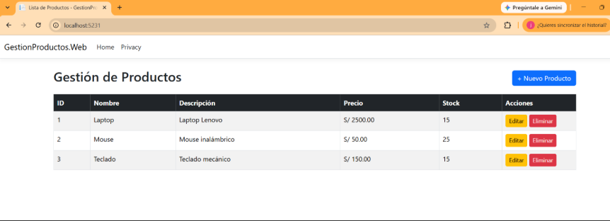
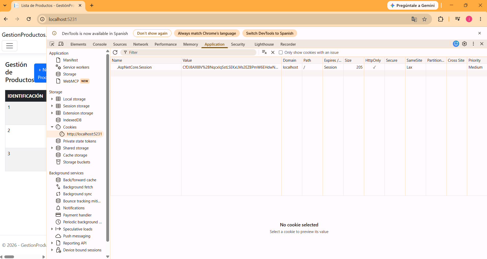
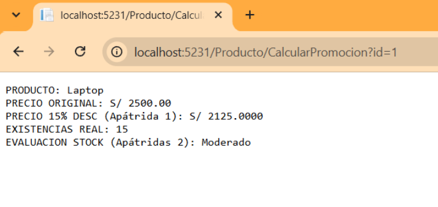

# 📦 Sistema de Gestión de Productos (Arquitectura N-Capas)

Sistema web completo para la gestión de productos (CRUD) desarrollado en **.NET 10**, implementando una **Arquitectura N-Capas** desacoplada mediante **ASP.NET Core MVC**, **ADO.NET** y **SQL Server**.

---

## 📐 Arquitectura del Sistema

El proyecto está diseñado siguiendo el patrón de arquitectura en N-Capas para garantizar la separación de responsabilidades, mantenibilidad y escalabilidad del código.

```text
               [ USUARIO / NAVEGADOR ]
                          │
                          ▼
        ┌──────────────────────────────────┐
        │     CAPA DE PRESENTACIÓN (WEB)   │
        │     ASP.NET Core MVC / Razor     │
        └─────────────────┬────────────────┘
                          │
                          ▼
        ┌──────────────────────────────────┐
        │  CAPA DE LÓGICA DE NEGOCIO (BLL) │
        │     Reglas de Negocio / Valid.   │
        └─────────────────┬────────────────┘
                          │
                          ▼
        ┌──────────────────────────────────┐
        │   CAPA DE ACCESO A DATOS (DAL)   │
        │     ADO.NET (SqlClient)          │
        └─────────────────┬────────────────┘
                          │
                          ▼
        ┌──────────────────────────────────┐
        │          BASE DE DATOS           │
        │           SQL Server             │
        └──────────────────────────────────┘
```

### Descripción de las Capas

- **GestionProductos.Entidades**: Contiene la clase de dominio `Producto.cs`. Es una capa transversal utilizada por las demás capas para transportar la información estructurada.

- **GestionProductos.DAL (Data Access Layer)**: Implementa ADO.NET (`SqlConnection`, `SqlCommand`, `SqlDataReader`) para conectarse directamente a SQL Server y ejecutar consultas/procedimientos.

- **GestionProductos.BLL (Business Logic Layer)**: Contiene la lógica de negocio y las validaciones de los datos (ej. verificación de precios > 0, nombres no nulos y stock no negativo) antes de procesarlos en la BD.

- **GestionProductos.Web (Presentation Layer)**: Desarrollada con ASP.NET Core MVC. Recibe las peticiones HTTP mediante `ProductoController.cs` y renderiza las vistas con Razor (`.cshtml`).

---

## 🚀 Tecnologías Utilizadas

- **Lenguaje**: C# (.NET 10 SDK)
- **Framework Web**: ASP.NET Core MVC
- **Acceso a Datos**: ADO.NET (Microsoft.Data.SqlClient)
- **Base de Datos**: SQL Server
- **Frontend**: Razor Views, HTML5, CSS3, Bootstrap 5

---

## 🛠️ Configuración e Instalación

### Prerrequisitos

- .NET 10 SDK
- SQL Server
- SQL Server Management Studio (SSMS) o sqlcmd

### 1. Base de Datos

Ejecutar el siguiente script en tu instancia de SQL Server para crear la base de datos y la tabla correspondiente:

```sql
CREATE DATABASE GestionProductos;
GO

USE GestionProductos;
GO

CREATE TABLE Productos
(
    Id INT IDENTITY(1,1) PRIMARY KEY,
    Nombre VARCHAR(100) NOT NULL,
    Descripcion VARCHAR(250),
    Precio DECIMAL(10,2) NOT NULL,
    Stock INT NOT NULL
);
GO

-- Datos de prueba opcionales
INSERT INTO Productos (Nombre, Descripcion, Precio, Stock)
VALUES
('Laptop', 'Laptop Lenovo 16GB RAM', 2500.00, 10),
('Mouse', 'Mouse inalámbrico ergonómico', 50.00, 25),
('Teclado', 'Teclado mecánico RGB', 150.00, 15);
GO
```

### 2. Cadena de Conexión

Asegurarse de actualizar la cadena de conexión en el archivo `GestionProductos.Web/appsettings.json` según el entorno local:

```json
{
  "ConnectionStrings": {
    "ConexionSQL": "Server=localhost;Database=GestionProductos;Trusted_Connection=True;TrustServerCertificate=True;"
  }
}
```

> **Nota**: Si utiliza SQL Server Express, cambie `localhost` por `localhost\SQLEXPRESS`.

### 3. Ejecución del Proyecto

Clone el repositorio:

```bash
git clone https://github.com/Joshua150453/Tecnolog-as-de-Construcci-n-de-Software.git
cd Tecnolog-as-de-Construcci-n-de-Software
```

Restaure las dependencias y compile la solución:

```bash
dotnet build
```

Inicie la aplicación web:

```bash
dotnet run --project GestionProductos.Web
```

Abra su navegador e ingrese a la URL mostrada en la consola (ej. `http://localhost:5231`).

---

## 📋 Funcionalidades (CRUD)

- [x] **Consultar (Read)**: Listado general de productos registrados en la base de datos.
- [x] **Registrar (Create)**: Formulario para ingresar nuevos productos con validación de datos en tiempo real.
- [x] **Editar (Update)**: Modificación de nombre, descripción, precio y stock de productos existentes.
- [x] **Eliminar (Delete)**: Borrado de productos en la base de datos con confirmación de seguridad.

---

# Funciones Stateful y Stateless en Arquitectura N-Capas
 
## 1. Resumen
 
El objetivo de esta implementación fue evolucionar el sistema de gestión de productos hacia un modelo multicapa robusto en C# .NET, integrando y clasificando funciones **Stateful** y **Stateless** en la capa de negocio (BLL). Esta división permite optimizar el rendimiento, garantizar la integridad de los datos y estructurar el sistema siguiendo los principios SOLID y patrones de diseño modernos.
 
## 2. Estructura de la Arquitectura (N-Layer)
 
El proyecto se dividió en cuatro capas con responsabilidades delimitadas:
 
| Capa | Responsabilidad |
|---|---|
| **GestionProductos.Entidades** | Define los modelos de datos (`Producto.cs`). |
| **GestionProductos.DAL** (Capa de Acceso a Datos) | Maneja las consultas directas a SQL Server mediante ADO.NET. |
| **GestionProductos.BLL** (Capa de Lógica de Negocio) | Aloja las 4 funciones objeto de prueba (Stateful y Stateless). |
| **GestionProductos.Web** (Capa de Presentación) | Controlador (`ProductoController.cs`) y vistas que capturan solicitudes y retornan datos al cliente. |
 
## 3. Clasificación de Funciones Implementadas
 
### A. Funciones Stateful (Con Estado)
 
Son aquellas que modifican o leen un estado que persiste a lo largo del tiempo. Tienen efectos secundarios sobre el sistema.
 
#### `ModificarStockStateful` (Persistencia Permanente en Disco)
 
- **Ubicación:** `ProductoBLL.cs`
- **Mecanismo:** Ejecuta sentencias SQL `UPDATE` hacia la base de datos SQL Server mediante la capa DAL.
- **Comportamiento:** Si la aplicación se apaga o reinicia, la información **permanece guardada** en la BD de forma indefinida.

 
#### `AgregarAlCarritoStateful` (Persistencia Temporal en Memoria RAM)
 
- **Ubicación:** `ProductoBLL.cs` / `ProductoController.cs`
- **Mecanismo:** Almacena objetos en la sesión del usuario (`HttpContext.Session`) utilizando cookies identificadoras (`.AspNetCore.Session`).
- **Comportamiento:** El estado se mantiene activo mientras el navegador y la aplicación estén corriendo. Si el servidor se apaga (`dotnet run`), la memoria RAM se limpia y la sesión se vacía.

 
### B. Funciones Stateless (Sin Estado / Apátridas)
 
Son funciones puras. No modifican variables globales, no escriben en la base de datos ni leen/escriben en la sesión HTTP. Mismo *input* siempre genera exactamente el mismo *output*.
 
#### `CalcularPrecioConDescuentoStateless` (Cálculo Puro)
 
- **Ubicación:** `ProductoBLL.cs`
- **Mecanismo:** Recibe variables numéricas (`precio` y `porcentajeDescuento`) y calcula el valor en RAM mediante una fórmula matemática.
- **Comportamiento:** Devuelve el precio simulado en tiempo de ejecución sin alterar el precio original almacenado en SQL Server.
#### `EvaluarNivelStockStateless` (Evaluación de Reglas de Negocio)
 
- **Ubicación:** `ProductoBLL.cs`
- **Mecanismo:** Analiza un valor numérico (`stock`) a través de estructuras condicionales para categorizar el inventario (*Agotado*, *Bajo*, *Moderado*, *Óptimo*).
- **Comportamiento:** Realiza una lectura reactiva sin afectar ni consultar estados externos.

 
## 4. Enlaces de Prueba HTTP (URLs del Sistema)
 
Para la verificación funcional del sistema desplegado localmente en `http://localhost:5231`, se utilizan las siguientes rutas:
 
- **Página Principal (Listado general):**
  `http://localhost:5231/Producto`
- **Prueba Stateful 1 (Ajuste de Stock permanente en SQL Server):**
  `http://localhost:5231/Producto/AjustarStock?id=1&ajuste=5`
- **Prueba Stateful 2 (Agregar al Carrito en Sesión HTTP):**
  `http://localhost:5231/Producto/AgregarCarrito?id=1`
- **Prueba Stateless 1 y 2 (Cálculo de descuento y estado de stock en tiempo real):**
  `http://localhost:5231/Producto/CalcularPromocion?id=1`

# GestionProductos — Internacionalización (i18n) y Estabilización del Proyecto

## 1. Resumen Ejecutivo

Se completó con éxito la implementación de **Internacionalización (i18n)** en la capa web de la aplicación ASP.NET Core (`GestionProductos.Web`). Asimismo, se resolvieron y sanearon los conflictos de integración en el control de versiones (Git/GitHub), logrando una solución estable, funcional y sincronizada que respeta la arquitectura multicapa y las funcionalidades *stateful* y *stateless* existentes.

## 2. Acciones Realizadas

### A. Configuración de Internacionalización (i18n)

**Middlewares y Servicios en `Program.cs`:**
- Se registraron los servicios de localización mediante `.AddViewLocalization()` y `.AddDataAnnotationsLocalization()`.
- Se configuró la ruta raíz de recursos (`Resources`) y se integró `RequestLocalizationMiddleware`.

**Creación de Archivos de Recursos (`.resx`):**
- Se crearon los archivos de diccionarios en la estructura correspondiente:
  - `GestionProductos.Web/Resources/Views/Producto/Index.es.resx` (Español)
  - `GestionProductos.Web/Resources/Views/Producto/Index.en.resx` (Inglés)

**Selector de Idioma e Interfaz de Usuario:**
- En `_Layout.cshtml`, se integró un selector de idiomas desplegable (*dropdown*) que invoca la acción del controlador.
- En `ProductoController.cs`, se implementó la acción `CambiarIdioma`, la cual persiste la cultura seleccionada (`en` / `es`) mediante la cookie estándar `CookieRequestCultureProvider`.

### B. Resolución de Conflictos y Control de Versiones

**Sincronización con GitHub:**
- Durante el proceso de integración (`git pull` / `git push`), se generaron conflictos de fusión (*merge conflicts*) en los siguientes archivos:
  - `GestionProductos.BLL/ProductoBLL.cs`
  - `GestionProductos.Web/Controllers/ProductoController.cs`
  - `GestionProductos.Web/Program.cs`

**Saneamiento del Código:**
- Se eliminaron manualmente todos los marcadores residuales de conflicto de Git (`<<<<<<<`, `=======`, `>>>>>>>`) que provocaban los errores de compilación **CS8300**.
- Se preservó intacta la lógica de negocio previa:
  - Persistencia en base de datos SQL Server.
  - Gestión del carrito basado en sesión HTTP.
  - Utilidades *stateless* para cálculo de descuentos y evaluación de stock.

**Commit y Sincronización Remota:**
- Se realizó la confirmación de cambios (*commit*) y el envío (*push*) exitoso a la rama `main` del repositorio de GitHub: `Joshua150453/Tecnolog-as-de-Construcci-n-de-Software`.

## 3. Estado Actual de la Aplicación

| Componente / Característica       | Estado | Observaciones                                                              |
|------------------------------------|:------:|-----------------------------------------------------------------------------|
| Compilación (.NET)                 | ✅ OK  | Ejecución limpia sin errores a través de `dotnet run`.                     |
| Internacionalización (i18n)        | ✅ OK  | Alternancia fluida entre Español e Inglés mediante cookies de sesión.      |
| Arquitectura N-Capas                | ✅ OK  | Entidades, DAL, BLL y Web operando de forma desacoplada.                   |
| Funciones Stateful / Stateless      | ✅ OK  | Gestión de inventario, carrito de compras y reglas sin estado funcionando. |
| Repositorio GitHub                  | ✅ OK  | Código local sincronizado con el repositorio remoto.                      |


## 👤 Autor

**Joshua David Ortiz Rosas** - [Joshua150453](https://github.com/Joshua150453)
